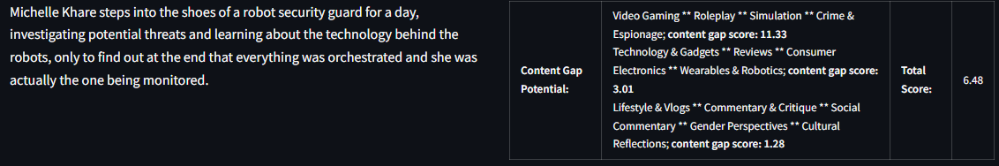
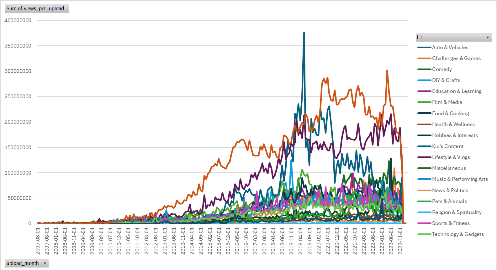
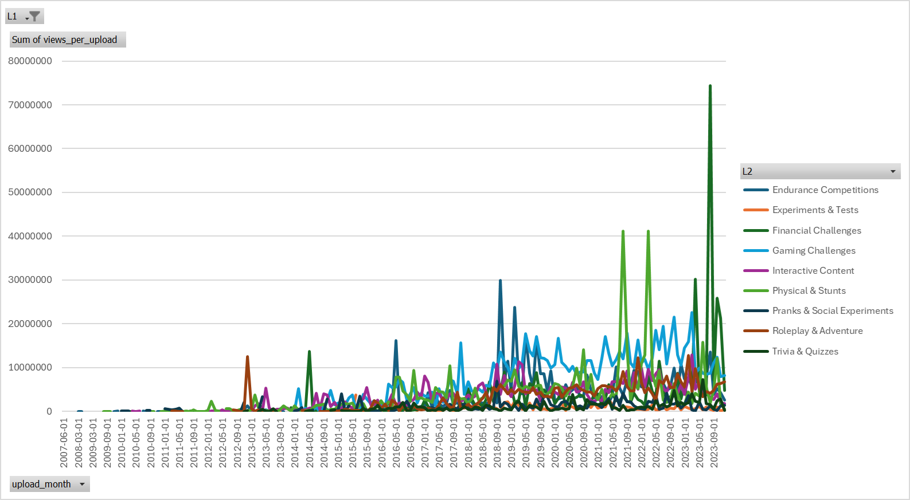

# YouTube Category Performance Analyzer

This tool analyzes content categories on YouTube using AI categorization to track views and upload metrics. It identifies potential content opportunities by calculating views/upload scores for different categories.

## Content Gap App

Interactive Streamlit app with three features:
1. Generate video concepts, get AI categorization with top 3 similar categories, and content gap score
2. Analyze user-provided video concepts
3. Analyze video titles

*example analysis*


### Setup

1. Clone the Repo
2. Create virtual environment
3. Install dependencies:
   ```bash
   pip install -r requirements.txt
   ```
4. Create `.env` file:
   ```
   OPENAI_API_KEY=your_key_here
   ```
5. Run the app:
   ```bash
   streamlit run app_content_gap.py
   ```

## Analysis Results

The analysis is based on a subsample of YouTube videos from our analytics assets catalog.


*Views/Upload for Level 1 Categories*


*Views/Upload for Level 2 Categories under 'Challenges & Games'*

Data source: `data/category_performance_v2.xlsx`
